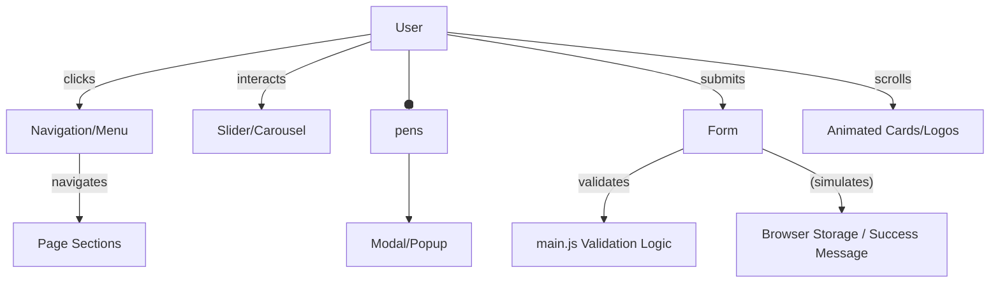
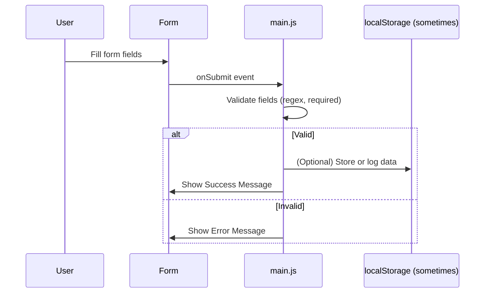
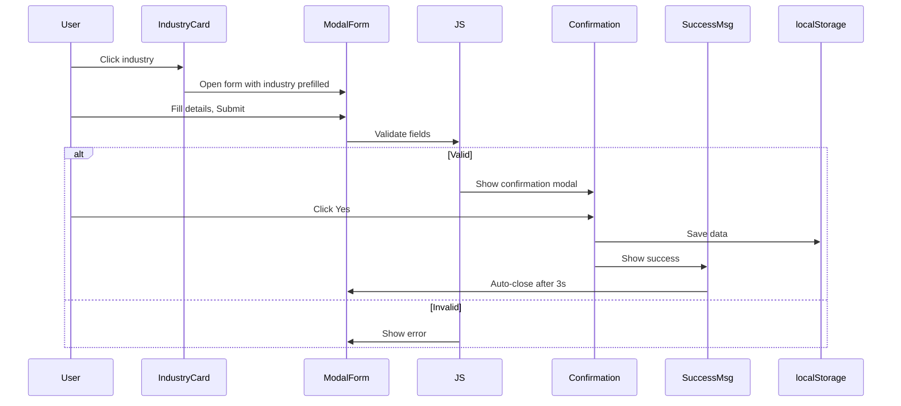
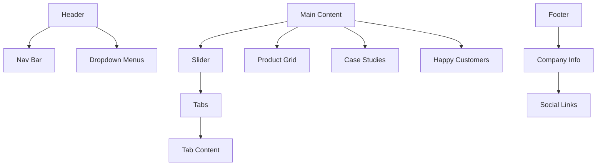

# Reputable Technologies Pvt Ltd Web Suite  
*Comprehensive Documentation & Architecture*

---

## 📚 Table of Contents

1. [Project Overview](#project-overview)
2. [File Structure](#file-structure)
3. [Core Features & Modules](#core-features--modules)
4. [File-by-File Documentation](#file-by-file-documentation)  
    - [Landing & Navigation](#landing--navigation)
    - [Company & Partnership](#company--partnership)
    - [Products & Solutions](#products--solutions)
    - [Case Studies](#case-studies)
    - [Clients & Contact](#clients--contact)
5. [UI/UX, CSS & JavaScript Architecture](#uiux-css--javascript-architecture)
6. [System Architecture & Data Flows](#system-architecture--data-flows)
7. [Accessibility & Responsiveness](#accessibility--responsiveness)
8. [Contributing & Debugging](#contributing--debugging)
9. [Appendix: Mermaid Diagrams](#appendix-mermaid-diagrams)

---

## 🚀 Project Overview

**Reputable Technologies Pvt Ltd** presents a modular, responsive, and modern suite of web pages for business presentation, product marketing, partner and client engagement, and real-world technology solution case studies. The suite includes:
- Marketing homepage
- Product detail pages
- Case study showcases
- Contact, partnership, and client trust sections
- Modern navigation and popups
- Built-in accessibility and responsive design

---

## 🗂️ File Structure

| File                          | Description                                             |
|-------------------------------|--------------------------------------------------------|
| **index.html**                | Main homepage; slider, solutions, products, cases      |
| **about.html**                | Company profile, mission, offerings, industries        |
| **solutions.html**            | Custom software, mobile, web dev, product grid         |
| **case_studies.html**         | Case study showcase grid                               |
| **case_study_MOFSL.html**     | Motilal Oswal Financial Services case                  |
| **case_study_MASOOM.html**    | MASOOM Foundation case                                 |
| **case_study_DRDO.html**      | DRDO Research Center Imarat case                       |
| **clientele.html**            | "Happy Customers" marquee and product grid             |
| **contact.html**              | Contact form, address, business hours, products        |
| **partner.html**              | Become a Partner, form, eligibility, products          |
| **ezattendancepro.html**      | Product: Attendance & Leave Management                 |
| **ezpayrollpro.html**         | Product: Payroll Management                            |
| **ezaccesspro.html**          | Product: Access Management                             |
| **ezvms.html**                | Product: Visitor Management                            |
| **ezcrm.html**                | Product: CRM                                           |
| **ezcanteen.html**            | Product: Canteen Management                            |
| **styles.css**                | Global & modular CSS styles                            |
| **main.js**                   | Navigation, popups, slider, form validation, effects   |
| **readme.md**                 | (This file)                                            |

---

## 🏆 Core Features & Modules

- **Multi-level responsive navigation** with adaptive submenus
- **Animated homepage slider** (images, touch, keyboard, auto-slide)
- **Product showcase** (descriptions, icons, feature lists)
- **Case study storytelling** (real business value, process, results)
- **Interactive forms** (contact, inquiry, partnership, trial)
- **Floating modals & popups** (trial, industry queries, partner apply)
- **Clients & testimonials** (animated marquee of customer logos)
- **Modern, accessible, and mobile-friendly UI**
- **All static, no backend included** (form data is simulated and/or stored in browser)
- **Reusable CSS and JS patterns**

---

## 📄 File-by-File Documentation

---

### 🏠 **Landing & Navigation**

#### `index.html`
- **Purpose**: Homepage; central hub for visitors.
- **Sections**:
    - **Header**: Company branding, sticky navbar, dropdowns.
    - **Hero/Slider**: Animated image slider with auto & manual navigation.
    - **Software Solutions**: Tabbed interface for "Custom Software", "Mobile App", "Web Development" (switches with smooth animation).
    - **Our Products**: Grid with icons, hover effects, and links.
    - **Case Studies**: Highlighted summaries, links to details.
    - **Happy Customers**: Animated client logo marquee (dual-row, bi-directional).
    - **Footer**: Company info, links, services, contacts, certifications.
    - **Popup Modal**: "Get free Trial" form modal, shows after 3s on first visit.

#### `main.js`
- **Purpose**: Core JS for navigation, popups, slider, and forms
- **Features**:
    - Mobile nav toggle, submenu open/close, click-outside to close.
    - Handles popup overlays (trial, partner, forms) and focus trapping.
    - Slider logic: next/prev, auto-slide, dots, touch/swipe, keyboard, pause-on-hover.
    - Form validation (`required`, format, real-time feedback), disables button on submit, auto-resets.
    - Stores form data in browser or simulates submission.
    - Accessibility: handles Escape key, focus, ARIA considerations.

---

### 🏢 **Company & Partnership**

#### `about.html`
- **Purpose**: About the company: story, mission, what we offer, industries served.
- **Highlights**:
    - Hero section with animated logo and gradients.
    - Mission, story, and product list.
    - **Industries We Serve**: Interactive cards, opens modal for industry-specific inquiries (modal with form, confirmation, and success feedback).
    - Form data is stored in browser `localStorage` (demo).
    - Footer with address, contact, certifications.
  
#### `partner.html`
- **Purpose**: Become a partner / reseller onboarding.
- **Sections**:
    - Company invitation and description of partner opportunities.
    - Criteria for eligibility, steps, and expectations.
    - Modal form for partnership application (real-time validation, error feedback, modal UX).
    - Success message; form resets on close.
    - Product grid and "Happy Customers" reused from other files.

---

### 💼 **Products & Solutions**

#### `solutions.html`
- **Purpose**: Service offering detail page.
- **Sections**:
    - Custom software, mobile app, and web development solutions.
    - Each solution: description, feature list, large image—alternating layout.
    - Call-to-action section.
    - Product grid as seen elsewhere.
    - Happy Customers (client logos).
    - Footer and scripts reused.

#### Product Pages (`ezattendancepro.html`, `ezpayrollpro.html`, `ezaccesspro.html`, `ezvms.html`, `ezcrm.html`, `ezcanteen.html`)
- **Purpose**: Each page provides a deep dive into a specific software product.
- **Common Structure**:
    - Hero: Icon, name, subtitle, color-themed gradient.
    - Introduction: What the product is and solves.
    - Key Features: As cards, each with icon, title, and explanation (hover effect, color-coded).
    - Footer and navigation included.
- **Product-Specific Features**:
    - *EzAttendancePro*: Attendance, leave, policy, analytics, payroll integration.
    - *EzPayrollPro*: Salary, compliance, self-service, HR integration, deductions.
    - *EzAccessPro*: Access control, group/user/reader management, MIS, unified platform.
    - *EzVMS*: Visitor registration, badges, security, evacuations, compliance, tracking.
    - *EzCRM*: Contact, sales, marketing, automation, analytics, mobile.
    - *EzCanteen*: Menu, ordering, user accounts, inventory, feedback, ID integration.

---

### 📚 **Case Studies**

#### `case_studies.html`
- **Purpose**: Main grid listing all available case studies.
- **Features**:
    - Card layout, badge for sector (finance, defense, education, healthcare).
    - Each card: Image, headline, short summary, "Read Full Case Study" link.

#### `case_study_MOFSL.html` (Motilal Oswal Financial Services Limited)
- **Purpose**: In-depth look at how RTPL built a custom software solution for a major financial firm.
- **Structure**:
    - Hero: Brand, subtitle, description.
    - Overview: Business challenges.
    - Challenges: Manual data, inefficient reporting, compliance.
    - Solutions: Expense tracker, asset/inventory/HR compliance modules.
    - Results: Improved efficiency, reporting, compliance, centralization.
    - Conclusion: Value delivered.

#### `case_study_MASOOM.html` (MASOOM Foundation)
- **Purpose**: How RTPL digitalized a non-profit's education processes.
- **Structure**:
    - Overview: Manual paper burden, lack of centralization, costs.
    - Challenges/Solutions: ERP, data repository, CEO dashboard, analytics.
    - Results: Efficiency, cost saving, reporting, transparency.
    - Conclusion: Digital transformation for non-profit operations.

#### `case_study_DRDO.html` (Research Center Imarat)
- **Purpose**: ERP for a defense lab with focus on security & integration.
- **Structure**:
    - Project overview, development process (with icons), module breakdown.
    - Integrations: Hardware, lockers, key management, MIS reports.
    - Results: Security, operational efficiency, access control, resource management.
    - Conclusion: Successfully meeting stringent defense needs.

---

### 👥 **Clients & Contact**

#### `clientele.html`
- **Purpose**: Show off trusted client brands and product grid.
- **Features**:
    - Bi-directional animated logo rows (customer logos).
    - Reusable product grid.
    - Footer as elsewhere.

#### `contact.html`
- **Purpose**: Get in touch!
- **Sections**:
    - Contact form (full name, contact, email, message).
    - Real-time validation, error feedback, success popup.
    - Company address, phone, business hours.
    - Happy Customers (logos) and product grid.
    - JS handles input enhancements, auto-formatting, smooth scrolling to errors.

---

## 🎨 UI/UX, CSS & JavaScript Architecture

### CSS (`styles.css`)

- **Variables & Resets**: Consistent font, colors, box-sizing, zero margins.
- **Header & Navigation**: Sticky, adaptive, multi-level with dropdowns and mobile transitions.
- **Cards & Grids**: Product, feature, case study, and client cards are visually separated, animated on hover, and responsive.
- **Forms**: Accessible, error highlighting, real-time feedback, disabled states.
- **Popups/Modals**: Animated in/out, background blur, focus trap, ARIA support.
- **Slider**: Custom styles, navigation arrows, dots, auto/halt on hover/touch.
- **Footer**: Multi-column, social links, certifications.

### JS (`main.js` + inline scripts)
- **Navigation**: Click/touch support, closes on outside click, keyboard esc.
- **Forms**: Field validation via regex, disables submit on error, shows/hides error messages, resets on close/submit.
- **Slider**: Handles next/prev/dot nav, auto-slide, touch gestures, accessibility.
- **Modals**: Handles overlay, focus, disables background scroll, closes via esc/click-outside.
- **Animation**: Intersection observers for fade-in, card animations, logo carousel pauses on hover/blur.

---

## 🧩 System Architecture & Data Flows

This is a **static frontend web suite**. No server/database is included. All forms simulate submission (some store in `localStorage` for demo).

### **Component Interaction Diagram**

### **Form Submission (No Backend)**

---

## ♿ Accessibility & Responsiveness

- All interactive elements have `:focus` styles and ARIA labels.
- Keyboard navigation for tabs, sliders, popups.
- Color contrasts, font sizes, and spacing meet accessibility best practices.
- All modals trap focus and close on ESC.
- Animations respect "prefers-reduced-motion".
- Responsive design (CSS grid/flex, adaptive paddings, font scaling).

---

## 🛠️ Contributing & Debugging

- **Debugging utilities**: Some forms (e.g., `about.html` inquiry) expose `getAllSubmissions()` and `clearAllSubmissions()` globally in browser console for demo/testing.
- **Adding new products/cases**: Duplicate card blocks and update icons/text. For forms, extend validation patterns if needed.
- **Styling**: Modular CSS; add new classes following existing patterns for effects/transitions.
- **JS**: Use unobtrusive event listeners; avoid inline JS except for page-specific logic.

---

## 🖼️ Appendix: Mermaid Diagrams

### **Case Study Data Flow (Example: Industry Inquiry in about.html)**

### **UI Component Map**

---

## 🎯 **Summary**

This suite provides a comprehensive, modern, and visually appealing web presence for a technology company. Every major product, case study, and engagement channel is given prominence, with reusable visual and code components, accessibility best practices, and a focus on clear user journey. The codebase is easy to extend, adapt, and maintain.

---

**Any questions or contributions? Contact us or open an issue!**

---

**Reputable Technologies Pvt Ltd** - *Empowering businesses with technology and trust.*